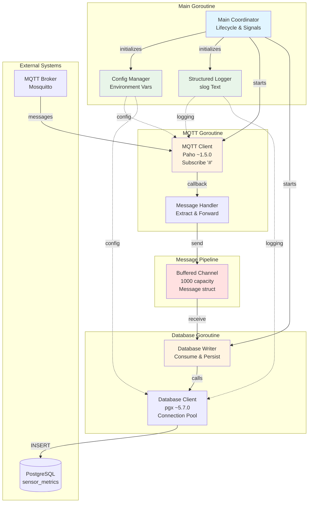

# Components

Based on the architectural patterns, tech stack, and monolithic service architecture, MQTT2BDD is organized into focused packages following Go best practices.

## Component: Main Application Coordinator

**Responsibility:** Application lifecycle management, goroutine coordination, signal handling, and graceful shutdown orchestration

**Key Interfaces:**
- Entry point: `func main()` in `cmd/mqtt2bdd/main.go`
- Signal handler: Captures SIGTERM/SIGINT for graceful shutdown
- Goroutine coordinator: Manages MQTT receiver and database writer lifecycles

**Dependencies:**
- All other components (config, logger, mqtt, database)
- Go stdlib: `os/signal`, `context`, `sync`

**Technology Stack:**
- Pure Go stdlib for signal handling and concurrency primitives
- Uses `sync.WaitGroup` for goroutine completion tracking
- Context-based cancellation for coordinated shutdown

**Architecture Notes:**
- Single goroutine responsible for initialization sequence
- Defers cleanup operations (MQTT disconnect, DB close) using Go's defer pattern
- Blocks on signal channel until shutdown requested
- Coordinates flush of buffered messages before exit

## Component: Configuration Manager

**Responsibility:** Load and validate all application configuration from environment variables

**Key Interfaces:**
- `LoadConfig() (*Config, error)` - Reads environment variables, returns populated Config struct or error
- `Config` struct - Holds all application settings (MQTT broker, PostgreSQL DSN, log level, buffer size)

**Dependencies:**
- Go stdlib: `os`, `strconv` (for parsing numeric env vars)

**Technology Stack:**
- Pure stdlib `os.Getenv()` - zero dependencies
- Returns explicit errors for missing required variables

**Configuration Structure:**
```go
type Config struct {
    // MQTT Configuration
    MQTTBroker   string
    MQTTPort     int
    MQTTUsername string // Optional
    MQTTPassword string // Optional

    // PostgreSQL Configuration
    PostgresHost string
    PostgresPort int
    PostgresDB   string
    PostgresUser string
    PostgresPassword string

    // Application Configuration
    LogLevel    string // DEBUG, INFO, ERROR
    BufferSize  int    // Message channel capacity (default: 1000)
    ExcludeTopics []string // MQTT topic filters whose messages are never persisted (default: none)
}
```

**Validation Rules:**
- Required fields: MQTT broker/port, PostgreSQL connection details
- Optional fields: MQTT auth (for anonymous brokers), BufferSize (default 1000), ExcludeTopics (default none)
- `MQTT_EXCLUDE_TOPICS` is a comma-separated list of MQTT 3.1.1 topic filters; each is validated at startup (`#` only as a whole final level, `+` only as a whole level), and an invalid filter aborts startup
- Log level defaults to INFO if invalid/missing

## Component: Structured Logger

**Responsibility:** Provide consistent structured logging across all components with configurable levels

**Key Interfaces:**
- `InitLogger(level string) *slog.Logger` - Initializes and returns configured logger
- Standard `slog.Logger` methods: `Info()`, `Debug()`, `Error()` with key-value context

**Dependencies:**
- Go stdlib: `log/slog`

**Technology Stack:**
- `log/slog` with Text handler for human-readable output
- Logs to stdout (Docker captures for centralized logging)
- ISO 8601 timestamps in UTC

**Example Configuration:**
```go
func InitLogger(level string) *slog.Logger {
    var logLevel slog.Level
    switch strings.ToUpper(level) {
    case "DEBUG":
        logLevel = slog.LevelDebug
    case "INFO":
        logLevel = slog.LevelInfo
    case "ERROR":
        logLevel = slog.LevelError
    default:
        logLevel = slog.LevelInfo
    }

    handler := slog.NewTextHandler(os.Stdout, &slog.HandlerOptions{
        Level: logLevel,
    })

    return slog.New(handler)
}
```

**Example Log Output:**
```
2026-02-13T14:30:00Z INFO MQTT2BDD starting version=0.1.0
2026-02-13T14:30:01Z INFO MQTT connected broker=mosquitto.local:1883
2026-02-13T14:30:01Z INFO Database connected host=postgres.local
2026-02-13T14:30:01Z INFO Subscribed to all topics
2026-02-13T14:30:15Z DEBUG Message received topic=zigbee2mqtt/bedroom/temp
2026-02-13T14:30:15Z DEBUG Message persisted sensor=bedroom/temp payload_size=45
2026-02-13T14:31:00Z ERROR Database write failed error="connection refused" attempt=1
```

**Log Context Fields (Consistent across application):**
- `timestamp` - ISO 8601 UTC
- `level` - DEBUG/INFO/ERROR
- `component` - Package/module name (e.g., "mqtt", "database", "main")
- `message` - Human-readable message
- Additional context: `event`, `error`, `duration_ms`, `topic`, `sensor`, etc.

## Component: MQTT Client

**Responsibility:** Manage MQTT broker connection, subscription to wildcard topics, automatic reconnection, and message reception

**Key Interfaces:**
- `NewClient(config *Config, logger *slog.Logger) *Client` - Constructor
- `Connect(ctx context.Context) error` - Establish connection to broker
- `Subscribe(topic string, handler MessageHandler) error` - Subscribe to topics with callback
- `Disconnect()` - Clean disconnect from broker
- `IsConnected() bool` - Connection health check

**Dependencies:**
- `github.com/eclipse/paho.mqtt.golang` ~1.5.0
- Logger component
- Config component

**Technology Stack:**
- Eclipse Paho MQTT client with QoS 0 (at-most-once delivery)
- Auto-reconnect configuration: 10-second interval
- Connection lost callback for logging and reconnection trigger

**Message Handler Signature:**
```go
type MessageHandler func(topic string, payload []byte)
```

**Reconnection Logic:**
- Paho client handles reconnection automatically with configured interval
- Connection lost callback logs ERROR with reason
- On reconnection, automatically re-subscribes to wildcard (`#`)
- Runs in background goroutine (non-blocking)

**Architecture Notes:**
- Wildcard subscription (`#`) captures all topics without configuration
- Message handler runs in separate goroutine per message (Paho behavior)
- No message acknowledgment (QoS 0) - optimized for throughput over guaranteed delivery

## Component: Database Client

**Responsibility:** Manage PostgreSQL connection pool, execute INSERT operations, automatic reconnection, connection health monitoring, and payload integrity (repair refusable content, classify write errors as transient or permanent)

**Key Interfaces:**
- `NewClient(config *Config, logger *slog.Logger) *Client` - Constructor
- `Connect(ctx context.Context) error` - Establish connection pool
- `InsertMessage(ctx context.Context, sensor string, timestamp time.Time, metrics json.RawMessage) error` - Persist message
- `Close()` - Close connection pool
- `IsConnected() bool` - Report the outcome of the most recent database interaction (no network call)
- `LastWriteAt() time.Time` - Time of the last successful write, or the zero value
- `WriteCount() uint64` - Monotonic count of successful writes since startup
- `RejectedCount() uint64` - Monotonic count of messages rejected since startup (Epic 5)
- `ErrRejected` - Sentinel returned (wrapped) by `InsertMessage` for a message that must not be retried (Epic 5)
- `LogPoolStats()` - Log the current connection pool statistics at DEBUG level

**Dependencies:**
- `github.com/jackc/pgx/v5/pgxpool` ~5.7.0
- Logger component
- Config component

**Technology Stack:**
- pgx v5 connection pool (min: 1, max: 5 connections)
- Prepared statements for INSERT operations (SQL injection protection)
- Context-based timeouts for all operations

**Connection Pool Configuration:**
```go
poolConfig.MinConns = 1  // Maintain at least one connection
poolConfig.MaxConns = 5  // Sufficient for single writer goroutine
poolConfig.MaxConnIdleTime = 5 * time.Minute
```

**SQL Operations:**
```sql
INSERT INTO sensor_metrics (sensor, date, metrics)
VALUES ($1, $2, $3)
ON CONFLICT (sensor, date) DO NOTHING;  -- Idempotent insert
```

**Reconnection Logic:**
- On write failure due to connection error, log ERROR
- Retry INSERT with 10-second backoff (uses context.WithTimeout)
- Connection verification happens implicitly on successful INSERT
- Failed messages remain in channel buffer (not lost)

**Error Handling:**
- Connection errors: Trigger reconnection loop
- Constraint violations (duplicate): Log WARNING, continue (idempotent)
- Content the database would refuse but that can be repaired (`\u0000`, unpaired surrogate escapes, invalid UTF-8): replace with U+FFFD, log WARN
- Permanent errors (invalid JSON, SQLSTATE class 22, 23 or 54): log ERROR `write_rejected`, return `ErrRejected`, never retried
- Other errors: Log ERROR with full context; the caller retries
- See [Error Handling Strategy §3](./error-handling-strategy.md#3-runtime-errors---data-integrity-log-and-skip)

## Component: Message Buffer (Channel)

**Responsibility:** Decouple MQTT message reception from database writes, provide in-memory buffering during database outages

**Key Interfaces:**
- Buffered channel: `msgChan := make(chan Message, config.BufferSize)`
- Producer: MQTT message handler sends to channel
- Consumer: Database writer goroutine receives from channel

**Dependencies:**
- None (native Go channel)

**Technology Stack:**
- Go buffered channel (native CSP primitive)
- Default capacity: 1000 messages (~5-10 minutes buffer at typical rates)

**Message Structure:**
```go
type Message struct {
    Topic     string
    Timestamp time.Time
    Payload   []byte  // Raw JSON
}
```

**Backpressure Behavior:**
- If channel full (1000 messages), MQTT handler **blocks** until space available
- Prevents memory overflow during prolonged database outages
- Health check logs WARNING when buffer >80% full

**Graceful Shutdown:**
- On SIGTERM, close channel to signal "no more messages"
- Database writer drains all remaining messages before exit
- WaitGroup ensures writer completes before application exits

## Component Diagram



## Package Organization (Internal Architecture)

```
cmd/mqtt2bdd/
    main.go                      # Main coordinator - goroutine lifecycle

internal/
    config/
        config.go                # Config struct, LoadConfig()
        config_test.go           # Table-driven tests

    logger/
        logger.go                # InitLogger(), slog wrapper
        logger_test.go           # Log output validation

    mqtt/
        client.go                # MQTT client wrapper (Paho)
        types.go                 # MessageHandler type, Message struct
        client_test.go           # Connection, subscription tests

    database/
        client.go                # PostgreSQL client wrapper (pgx)
        client_test.go           # Connection pool, INSERT tests
```

**Rationale for `internal/` usage:**
- All packages are application-specific (not reusable libraries)
- `internal/` prevents accidental import by other Go modules
- Clear signal: "private implementation, not public API"

## Concurrency Architecture

**Three Goroutines:**

1. **Main Goroutine:**
   - Initializes all components sequentially
   - Blocks on signal channel
   - Coordinates graceful shutdown

2. **MQTT Receiver Goroutine:**
   - Paho client callback runs in library-managed goroutine
   - Message handler sends to channel (blocking if full)
   - Lifecycle managed by Paho library

3. **Database Writer Goroutine:**
   - Infinite loop: `for msg := range msgChan`
   - Blocks when channel empty (efficient waiting)
   - Exits when channel closed (graceful shutdown)

**Synchronization:**
```go
var wg sync.WaitGroup
wg.Add(1)  // Database writer goroutine

// On shutdown:
close(msgChan)         // Signal writer to finish
wg.Wait()              // Wait for writer to drain buffer
dbClient.Close()       // Then close database connection
```

**Design Philosophy:**

The component architecture emphasizes **simplicity and clarity** for educational purposes while maintaining production-grade resilience. Each component has a single, well-defined responsibility with minimal coupling. The goroutine + channel pipeline demonstrates Go's CSP model without over-engineering—no worker pools, no complex synchronization primitives, just clean concurrent data flow.

All components are testable in isolation (dependency injection via constructors) and observable (structured logging at component boundaries).

---
