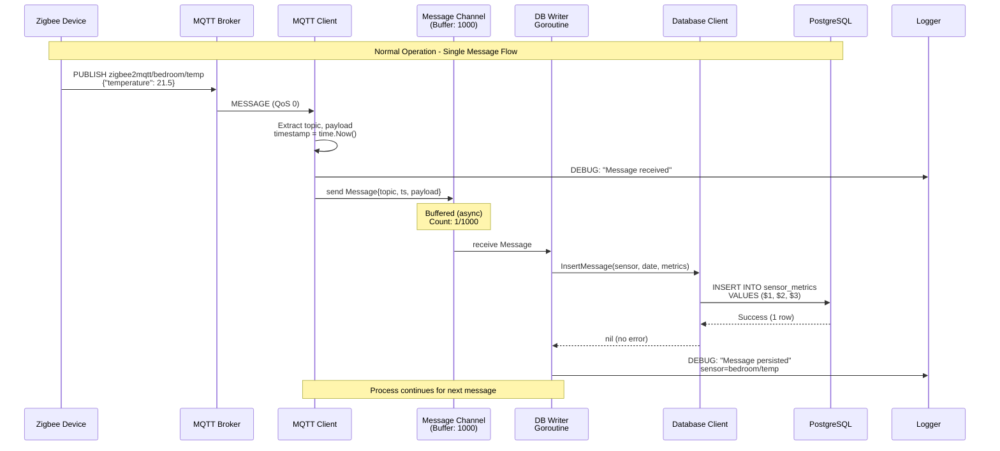
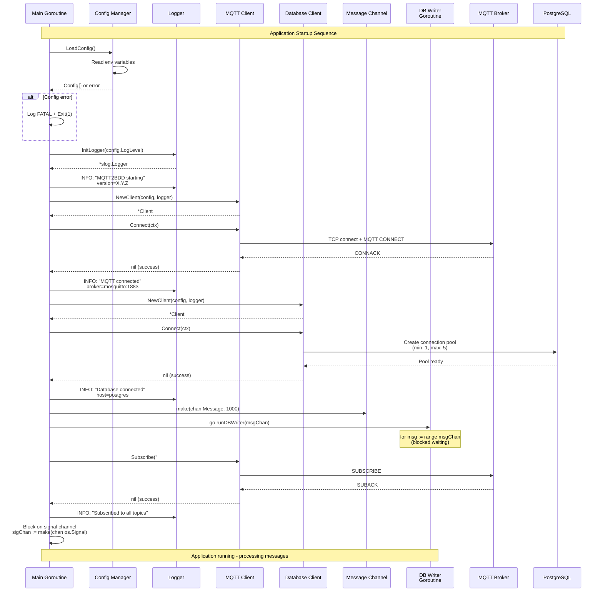
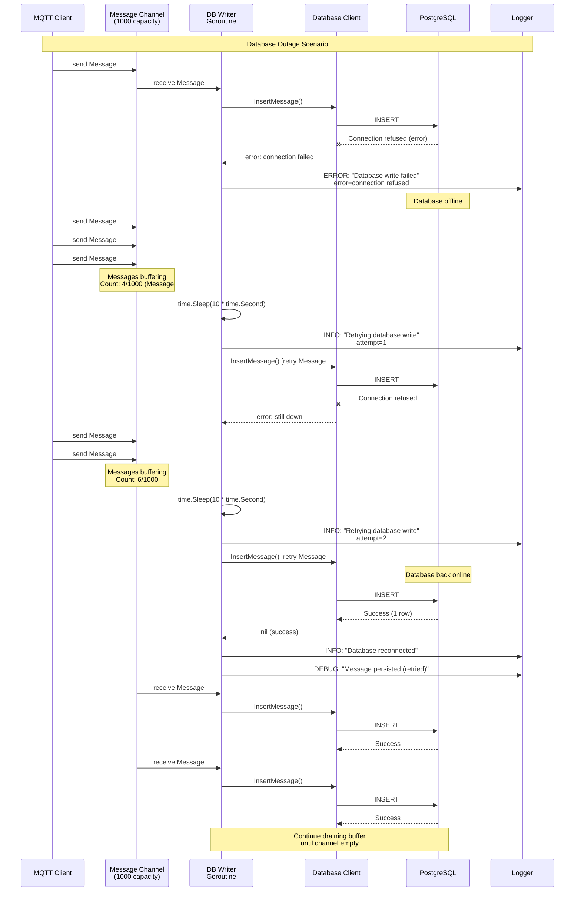
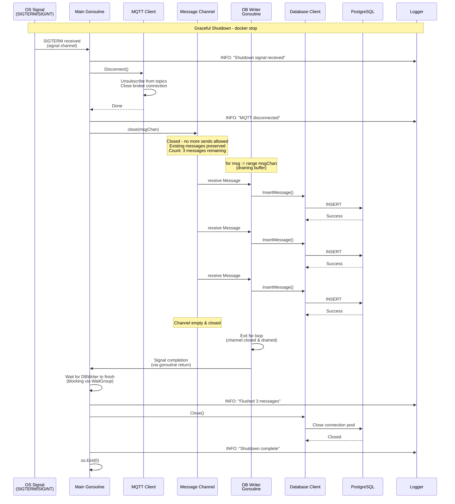
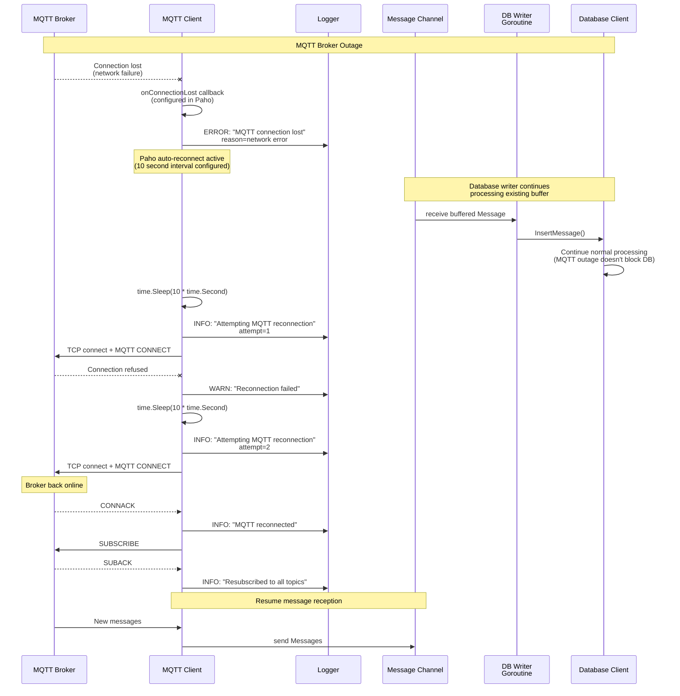

# Core Workflows

Key system workflows illustrated using sequence diagrams with standardized actor naming and accurate behavior.

## Actor Naming Convention

- **Main** - Main Goroutine (lifecycle coordinator)
- **ConfigMgr** - Configuration Manager
- **Logger** - Structured Logger (slog)
- **MQTTClient** - MQTT Client component (includes Paho goroutine)
- **MsgChannel** - Message Channel (buffered, capacity 1000)
- **DBWriter** - Database Writer Goroutine
- **DBClient** - Database Client (pgx pool wrapper)
- **PostgreSQL** - PostgreSQL database
- **MQTTBroker** - MQTT Broker (Mosquitto)
- **Device** - Zigbee2MQTT device (message source)

## Workflow 1: Normal Operation - Message Capture Flow



## Workflow 2: Application Startup Sequence



## Workflow 3: Database Outage & Recovery



## Workflow 4: Graceful Shutdown



## Workflow 5: MQTT Broker Disconnection & Reconnection



## Buffering Limits & Message Loss Scenarios

**Critical Understanding: Multiple Buffer Layers**

```
Zigbee Device → MQTT Broker → [Paho Internal Buffer] → [App Message Channel] → Database
                                 (configurable)           (1000 capacity)
```

**Buffer Configuration:**
```go
opts := mqtt.NewClientOptions()
opts.SetMessageChannelDepth(5000)  // Paho internal buffer (default: 100)

msgChan := make(chan Message, 1000)  // Application channel
```

**Message Loss Risk Matrix:**

| Scenario | Duration | Buffering Capacity | Message Loss? |
|----------|----------|-------------------|---------------|
| DB outage | < 5 min | App channel sufficient | **No** |
| DB outage | 5-10 min | App + Paho buffers | **No** (if rate < 10 msg/sec) |
| DB outage | > 10 min | Both buffers overflow | **Yes** |
| MQTT outage | Any | N/A - source unavailable | **Yes** (messages never received) |
| App crash (SIGKILL) | Instant | Buffers lost | **Yes** (in-memory only) |
| Graceful shutdown | < 30 sec | Buffers flushed | **No** |

## Error Handling Summary

| Error Scenario | Behavior | Recovery | Data Loss? |
|---------------|----------|----------|------------|
| **Startup failure** (config/connection) | Log FATAL, Exit(1) | Manual intervention required | N/A (app never started) |
| **Database outage** (< buffer capacity) | Buffer messages in channel, retry every 10s | Automatic when DB recovers | **No** |
| **Database outage** (> buffer capacity) | Both buffers full, Paho drops new messages | Automatic reconnect, but messages lost | **Yes** (overflow messages) |
| **MQTT outage** | Auto-reconnect every 10s, resubscribe on connect | Automatic when broker recovers | **Yes** (messages during outage never received) |
| **Channel full** (DB very slow) | MQTT handler blocks, Paho buffers internally | Unblocks when DB writer drains channel | **Depends** (no if Paho buffer sufficient, yes if Paho also fills) |
| **Duplicate message** | UNIQUE constraint violation on (sensor, date) | Log WARNING, skip (idempotent via ON CONFLICT) | **No** (duplicate rejected) |
| **Payload with repairable content** (`\u0000`, unpaired surrogate escape, invalid UTF-8) | Repaired to U+FFFD, WARN `payload_sanitized` | Immediate | **No** (content visibly altered) |
| **Payload the database can never accept** (invalid JSON, SQLSTATE class 22/23/54) | Discarded, ERROR `write_rejected`, never retried | Immediate; the next message proceeds | **Yes** (that message only) |
| **Empty payload** (clears a retained message) | Skipped, DEBUG `write_skipped` | Immediate | **No** (nothing to store) |
| **Excluded topic** (`MQTT_EXCLUDE_TOPICS`) | Dropped before buffering, DEBUG `message_excluded` | N/A | **No** (excluded by configuration) |
| **Graceful shutdown** (SIGTERM) | Drain both buffers before exit (< 30s) | Clean shutdown with flush | **No** |
| **Forced kill** (SIGKILL) | Immediate termination, no cleanup | None | **Yes** (all buffered messages lost) |

**Key Takeaway:**

The system provides **best-effort durability** with ~5-10 minutes of buffer capacity during database outages (depending on message rate). This is sufficient for typical transient failures (restarts, network blips) but **not guaranteed storage**. For critical applications requiring zero message loss, additional persistence layers (disk-based queues, MQTT QoS 1/2) would be needed—trade-offs consciously avoided for this learning-focused project.

---
