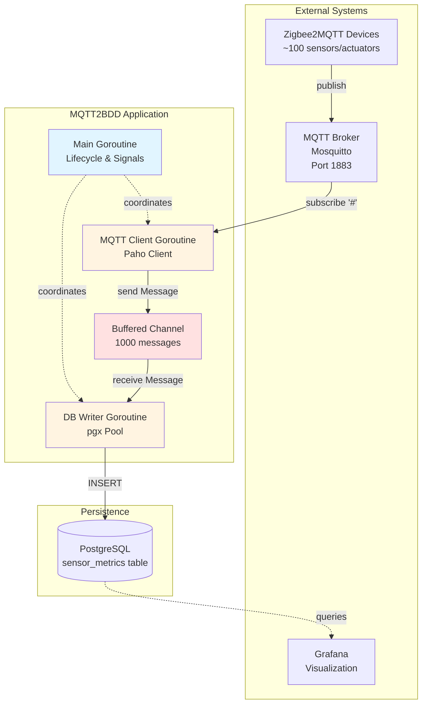

# High Level Architecture

## Technical Summary

MQTT2BDD implements a **resilient event-driven pipeline** architecture using Go's native concurrency primitives. The system acts as a stateless bridge between MQTT and PostgreSQL, employing goroutines and channels to achieve concurrent message ingestion and persistent storage. Core technology choices include Go 1.23+ for CSP-based concurrency, Eclipse Paho for MQTT protocol handling, and pgx/v5 for high-performance PostgreSQL integration. The architecture emphasizes automatic failure recovery, graceful degradation through buffering, and operational observability via structured logging—directly supporting the PRD goals of autonomous operation and educational codebase design.

## High Level Overview

**1. Architectural Style:** Event-Driven Monolith with Goroutine-Based Concurrency

**2. Repository Structure:** Monorepo (as specified in PRD Technical Assumptions)
- Single repository containing all application code, configuration, and deployment artifacts
- Standard Go project layout with `cmd/`, `internal/`, `pkg/` separation

**3. Service Architecture:** Monolith (as specified in PRD Technical Assumptions)
- Single-process Go application with three concurrent goroutines:
  - **Main goroutine:** Application lifecycle, signal handling, coordination
  - **MQTT receiver goroutine:** Subscribe to wildcard topics, publish to internal channel
  - **Database writer goroutine:** Consume from channel, persist to PostgreSQL
- No microservices, no inter-process communication

**4. Primary Data Flow:**
```
MQTT Broker (Zigbee2MQTT)
  → MQTT Client Goroutine (subscribe #)
  → Buffered Channel (1000 capacity)
  → Database Writer Goroutine
  → PostgreSQL (sensor_metrics table)
```

**5. Key Architectural Decisions:**

- **Goroutine + Channel Pipeline:** Decouples message reception from database writes, enabling buffering during DB outages and maximizing throughput
- **Wildcard MQTT Subscription (`#`):** Captures all topics without hardcoding device names, supporting dynamic device addition
- **Pre-existing Schema Assumption:** Application does not manage schema migrations, assumes `sensor_metrics` table exists (operational simplicity)
- **Buffered Channel (1000 messages):** Provides ~5-10 minutes of buffer time during database outages (assuming typical message rate)
- **Fixed Retry Intervals (10 seconds):** Simple, predictable reconnection behavior without exponential backoff complexity
- **Environment-Only Configuration:** Zero-dependency configuration using stdlib, no config files to manage

## High Level Project Diagram



## Architectural and Design Patterns

Based on the PRD requirements and Go best practices, here are the key patterns:

- **Communicating Sequential Processes (CSP):** Go's native goroutine + channel model for concurrent message processing - _Rationale:_ Idiomatic Go concurrency, provides natural backpressure through buffered channels, educational value for learning Go concurrency

- **Pipeline Pattern:** MQTT → Channel → Database as staged data flow - _Rationale:_ Decouples producers from consumers, enables buffering, simplifies error handling in each stage independently

- **Fail-Fast with Retry:** Explicit error returns with automatic reconnection loops - _Rationale:_ Aligns with Go error handling conventions, provides resilience without hiding failures, clear operational visibility

- **Repository Pattern (Lightweight):** Database client abstracts pgx connection pool and SQL operations - _Rationale:_ Enables testing with mocks, centralizes database logic, follows Go best practices for package organization

- **Configuration via Environment:** Twelve-Factor App principle using `os.Getenv()` - _Rationale:_ Zero dependencies, Docker-native configuration, simple deployment across environments

- **Structured Logging:** Go 1.21+ `log/slog` with text output - _Rationale:_ Human-readable logs for manual debugging, consistent context fields, no third-party dependencies

- **Graceful Shutdown:** Signal handling with WaitGroup coordination - _Rationale:_ Prevents message loss during container restarts, demonstrates proper goroutine lifecycle management

**Key Trade-offs:**
- **In-memory buffer only:** 1000 messages lost on application crash (acceptable given container restart speed and rare crash scenarios)
- **No schema migration:** Assumes pre-existing database schema (simplifies app, requires manual DB setup)
- **Fixed retry intervals:** Simple but not optimal for all failure scenarios (good for learning, could be enhanced with exponential backoff)

---
